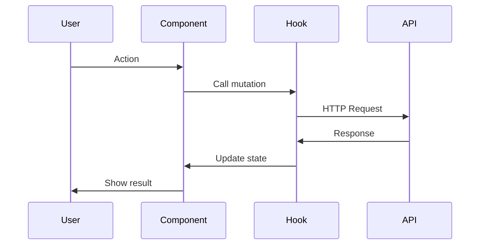

# Phase 2 & 3: Design + Implementation Planning

Transform approved requirements into technical design and actionable tasks.

## Prerequisites

- [ ] `requirements.md` exists in `.claude/specs/{feature-name}/`
- [ ] User has approved requirements (said "approved", "looks good", etc.)

## Your Task

1. **Read requirements.md**: Understand all user stories and acceptance criteria
2. **Research codebase**: Find existing patterns, components, APIs
3. **Create design.md**: Technical architecture document
4. **Get design approval**: User must approve before tasks
5. **Create tasks.md**: Ordered implementation checklist
6. **Get tasks approval**: User confirms the plan

## File Locations

```
.claude/specs/{feature-name}/
├── requirements.md  (already exists)
├── design.md        (create this)
└── tasks.md         (create this)
```

---

# Part 1: design.md

## Structure (MANDATORY)

```markdown
# {Feature Name} - Technical Design

## Overview
Brief summary of what we're building (1-2 sentences from requirements).

## Technical Resources
- React Query: https://tanstack.com/query/latest
- TanStack Router: https://tanstack.com/router/latest
- Shadcn/ui: https://ui.shadcn.com/
- FullCalendar: https://fullcalendar.io/docs/react
- i18next: https://www.i18next.com/
- Zod: https://zod.dev/

## Project Constants (MANDATORY - from CLAUDE.md)
| Type | Import From |
|------|-------------|
| Routes | `@/constants/routes` |
| Query Keys | `@/lib/query-keys` |
| Cache Times | `@/config/cache` |
| Invalidation | `@/lib/cache-invalidation` |

## Architecture

### Component Hierarchy
```
ParentComponent
├── ChildComponent1
│   └── GrandchildComponent
├── ChildComponent2
└── ChildComponent3
```

### Data Flow


## Data Models

### TypeScript Interfaces
```typescript
interface EntityName {
  id: string
  // ... fields
  createdAt: string
  updatedAt: string
}

interface CreateEntityDto {
  // ... required fields for creation
}

interface UpdateEntityDto {
  // ... optional fields for update
}
```

### Zod Validation Schema
```typescript
const entitySchema = z.object({
  field1: z.string().min(1, 'Required'),
  field2: z.number().min(0),
  // ...
})
```

## API Endpoints

| Method | Endpoint | Description | Request | Response |
|--------|----------|-------------|---------|----------|
| GET | /api/v1/... | List all | query params | PaginatedResponse<Entity> |
| GET | /api/v1/.../:id | Get one | - | Entity |
| POST | /api/v1/... | Create | CreateDto | Entity |
| PATCH | /api/v1/.../:id | Update | UpdateDto | Entity |
| DELETE | /api/v1/.../:id | Delete | - | void |

## Components

### New Components
| Component | Location | Purpose |
|-----------|----------|---------|
| ComponentName | `src/features/{feature}/components/` | Description |

### Existing Components to Reuse
| Component | Location | How to Use |
|-----------|----------|------------|
| Dialog | `@/components/ui/dialog` | For modals |
| DataTable | `@/components/data-table` | For lists |

## State Management

### React Query Hooks
| Hook | Purpose | Cache Time |
|------|---------|------------|
| useEntities | List with filters | CACHE_TIMES.MEDIUM |
| useEntity | Single item | CACHE_TIMES.SHORT |
| useCreateEntity | Create mutation | - |

### Local State
| State | Component | Purpose |
|-------|-----------|---------|
| isOpen | Dialog | Controls visibility |
| filters | List | Filter parameters |

## Error Handling

| Error Code | Condition | User Message (AR/EN) |
|------------|-----------|----------------------|
| 400 | Validation failed | Show field errors |
| 401 | Not authenticated | Redirect to login |
| 403 | No permission | "You don't have permission" |
| 404 | Not found | "Item not found" |
| 409 | Conflict | Show specific message |

## RTL/LTR Considerations
- [ ] Text alignment switches correctly
- [ ] Icons flip where appropriate
- [ ] Date formats localized
- [ ] Form layouts adapt

## Testing Strategy

### Unit Tests
- Validation schema tests
- Utility function tests

### Integration Tests
- API hook tests with MSW
- Component rendering tests

### E2E Considerations
- Happy path flow
- Error state handling
```

---

# Part 2: tasks.md

## Structure (MANDATORY)

```markdown
# {Feature Name} - Implementation Tasks

## Overview
Step-by-step implementation plan linked to requirements.

## Phase Summary

| Phase | Goal | Tasks | Status |
|-------|------|-------|--------|
| 1 | Data Layer | 4 | Not Started |
| 2 | Core UI | 5 | Not Started |
| 3 | Integration | 3 | Not Started |
| 4 | Polish | 3 | Not Started |

---

## Phase 1: Data Layer
**Goal**: Types, services, and hooks working
**Testable**: Can fetch/mutate data, see in console

### Task 1.1: Create TypeScript Types
**File**: `src/types/{entity}.ts`
**Refs**: Requirement 1.1, 2.1
**Details**:
- Define main interface
- Define CreateDto, UpdateDto
- Define enum types if needed
**Status**: [ ] Not Started

### Task 1.2: Add Query Keys
**File**: `src/lib/query-keys.ts`
**Refs**: All requirements
**Details**:
- Add {entity}.all
- Add {entity}.lists()
- Add {entity}.list(filters)
- Add {entity}.detail(id)
**Status**: [ ] Not Started

### Task 1.3: Create Service
**File**: `src/services/{entity}Service.ts`
**Refs**: Design API Endpoints
**Details**:
- getAll(filters)
- getById(id)
- create(data)
- update(id, data)
- delete(id)
**Status**: [ ] Not Started

### Task 1.4: Create React Query Hooks
**File**: `src/hooks/use-{entity}.ts`
**Refs**: Design State Management
**Details**:
- useEntities(filters)
- useEntity(id)
- useCreateEntity()
- useUpdateEntity()
- useDeleteEntity()
**Status**: [ ] Not Started

---

## Phase 2: Core UI Components
**Goal**: Main UI working with real data
**Testable**: Can see list, open forms, submit

### Task 2.1: Create List Component
**File**: `src/features/{feature}/components/{entity}-list.tsx`
**Refs**: Requirement 1.x
**Details**:
- Use DataTable component
- Implement columns
- Add empty state
- Add loading state
**Status**: [ ] Not Started

### Task 2.2: Create Form Component
**File**: `src/features/{feature}/components/{entity}-form.tsx`
**Refs**: Requirement 2.x
**Details**:
- Use react-hook-form + zod
- All required fields
- Validation messages
- Submit handling
**Status**: [ ] Not Started

### Task 2.3: Create Detail View
**File**: `src/features/{feature}/components/{entity}-detail.tsx`
**Refs**: Requirement 1.x
**Details**:
- Display all fields
- Edit/Delete actions
- Loading state
**Status**: [ ] Not Started

---

## Phase 3: Integration
**Goal**: Feature connected to app
**Testable**: Full user flow works

### Task 3.1: Add Routes
**File**: `src/constants/routes.ts` + route files
**Refs**: All requirements
**Details**:
- Add route constants
- Create route files
- Add to router config
**Status**: [ ] Not Started

### Task 3.2: Add Navigation
**File**: Sidebar/menu components
**Refs**: All requirements
**Details**:
- Add menu item
- Add translations
**Status**: [ ] Not Started

### Task 3.3: Add Cache Invalidation
**File**: `src/lib/cache-invalidation.ts`
**Refs**: All mutations
**Details**:
- Add invalidation helpers
- Connect to mutations
**Status**: [ ] Not Started

---

## Phase 4: Polish
**Goal**: Production ready
**Testable**: RTL/LTR works, no errors

### Task 4.1: RTL/LTR Testing
**Refs**: Design RTL Considerations
**Details**:
- Test Arabic layout
- Test English layout
- Fix alignment issues
**Status**: [ ] Not Started

### Task 4.2: Add Translations
**File**: `src/locales/{ar,en}/*.json`
**Refs**: All UI text
**Details**:
- Add all UI strings
- Test both languages
**Status**: [ ] Not Started

### Task 4.3: Final Testing
**Refs**: All acceptance criteria
**Details**:
- Verify each EARS requirement
- Check console for errors
- Test edge cases
**Status**: [ ] Not Started

---

## Completion Checklist
- [ ] All tasks completed
- [ ] TypeScript compiles (`npm run build`)
- [ ] No console errors
- [ ] Arabic RTL works
- [ ] English LTR works
- [ ] All acceptance criteria met
```

---

## Example: Appointment Reminders

### design.md snippet
```markdown
## Data Models

### TypeScript Interfaces
```typescript
interface ReminderSettings {
  id: string
  userId: string
  defaultTiming: 15 | 30 | 60 | 1440 // minutes
  emailEnabled: boolean
  createdAt: string
  updatedAt: string
}

interface UpdateReminderSettingsDto {
  defaultTiming?: number
  emailEnabled?: boolean
}
```

## API Endpoints

| Method | Endpoint | Description |
|--------|----------|-------------|
| GET | /api/v1/reminder-settings | Get user's settings |
| PATCH | /api/v1/reminder-settings | Update settings |
```

### tasks.md snippet
```markdown
### Task 1.1: Create Reminder Types
**File**: `src/types/reminder.ts`
**Refs**: Requirement 2.1, 2.2
**Details**:
- ReminderSettings interface
- UpdateReminderSettingsDto
- ReminderTiming type (15 | 30 | 60 | 1440)
**Status**: [ ] Not Started
```

---

## After Creating design.md + tasks.md

1. **Show design.md to user** - "Here's the technical design. Does this approach work?"
2. **Get design approval** before showing tasks
3. **Show tasks.md to user** - "Here's the implementation plan. Ready to start?"
4. **Get tasks approval** before implementing
5. **Next step**: Run `/complete-phase` to execute Phase 1

## IMPORTANT

- **One approval at a time**: Design first, then tasks
- **Don't skip phases**: Each builds on the previous
- **Link to requirements**: Every task references acceptance criteria
- **Code-only tasks**: No testing, deployment, or docs tasks in tasks.md
