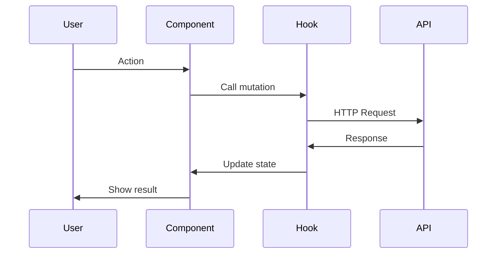

# Phase 2 & 3: Design + Implementation Planning

Transform approved requirements into technical design and actionable tasks.

## Prerequisites

- [ ] `requirements.md` exists in `.claude/specs/{feature-name}/`
- [ ] `.requirements-approved` marker exists (created by `/plan`)
- [ ] User has approved requirements

**🔒 Pre-Check: Verify Requirements Approval**
```bash
# Check marker file exists
ls .claude/specs/{feature-name}/.requirements-approved
```

If marker doesn't exist:
```markdown
❌ Cannot proceed - Requirements not approved

The `.requirements-approved` marker file is missing.

**Required action**: Run `/plan` and get user approval first.
```

## Your Task

1. **Read requirements.md**: Understand all user stories and acceptance criteria
2. **Research codebase**: Find existing patterns, components, APIs
3. **Create Impact Analysis**: Show what will be created/modified
4. **Create design.md**: Technical architecture document
5. **Get design approval**: User must approve before tasks
6. **Create tasks.md**: Ordered implementation checklist
7. **Get tasks approval**: User confirms the plan

## File Locations

```
.claude/specs/{feature-name}/
├── requirements.md  (already exists)
├── design.md        (create this)
└── tasks.md         (create this)
```

---

## 📋 IMPACT ANALYSIS (Do This First)

**MANDATORY**: Before writing design.md, analyze and show the impact:

```markdown
## 📋 Impact Analysis

### Files to CREATE (New)
| File | Purpose | Lines Est. |
|------|---------|------------|
| `src/types/reminder.ts` | Type definitions | ~30 |
| `src/hooks/useReminders.ts` | React Query hooks | ~80 |
| `src/services/reminderService.ts` | API service | ~50 |
| `src/components/reminders/ReminderSettings.tsx` | Settings UI | ~150 |

**Total New Files**: 4
**Total New Lines**: ~310

### Files to MODIFY (Existing - Higher Risk)
| File | Current Lines | What Changes | Lines Changed | Risk |
|------|---------------|--------------|---------------|------|
| `src/lib/query-keys.ts` | 45 | Add reminder keys | +5 | Low |
| `src/constants/routes.ts` | 120 | Add reminder routes | +3 | Low |
| `src/components/layout/sidebar-data.ts` | 200 | Add menu item | +8 | Low |

**Total Modified Files**: 3
**Total Lines Changed**: ~16

### Files NOT Touched (Confirming Safety)
| File | Why Safe |
|------|----------|
| `useAppointments.ts` | Separate concern, no overlap |
| `Calendar.tsx` | Different feature |
| Existing services | No shared state |

### Dependency Graph
```
requirements.md (approved)
    ↓
design.md
    ↓
tasks.md
    ↓
Phase 1: Types → Service → Hooks (data layer)
    ↓
Phase 2: Components (UI layer)
    ↓
Phase 3: Routes → Sidebar (integration)
    ↓
Phase 4: i18n → RTL testing (polish)
```

### Risk Assessment
| Risk | Likelihood | Impact | Mitigation |
|------|------------|--------|------------|
| Query key collision | Low | High | Prefix with feature name |
| Breaking existing queries | Low | High | Test existing features after |
| Bundle size increase | Low | Low | Lazy load new components |
| Route conflicts | Low | Medium | Check routes.ts first |

### Rollback Strategy
If implementation fails:
1. All new files can be deleted safely
2. Modified files: `git checkout -- {file}` to restore
3. Each phase is independently revertable
```

**Why this matters**: User knows exactly what will change before it happens.

---

# Part 1: design.md

## Structure (MANDATORY)

```markdown
# {Feature Name} - Technical Design

## Overview
Brief summary of what we're building (1-2 sentences from requirements).

## Impact Summary
- **New files**: X
- **Modified files**: Y
- **Risk level**: Low / Medium / High
- **Estimated tasks**: Z

## Technical Resources
- React Query: https://tanstack.com/query/latest
- TanStack Router: https://tanstack.com/router/latest
- Shadcn/ui: https://ui.shadcn.com/
- FullCalendar: https://fullcalendar.io/docs/react
- i18next: https://www.i18next.com/
- Zod: https://zod.dev/

## Project Constants (MANDATORY - from CLAUDE.md)
| Type | Import From |
|------|-------------|
| Routes | `@/constants/routes` |
| Query Keys | `@/lib/query-keys` |
| Cache Times | `@/config/cache` |
| Invalidation | `@/lib/cache-invalidation` |

## Architecture

### Component Hierarchy
```
ParentComponent
├── ChildComponent1
│   └── GrandchildComponent
├── ChildComponent2
└── ChildComponent3
```

### Data Flow


## Data Models

### TypeScript Interfaces
```typescript
interface EntityName {
  id: string
  // ... fields
  createdAt: string
  updatedAt: string
}

interface CreateEntityDto {
  // ... required fields for creation
}

interface UpdateEntityDto {
  // ... optional fields for update
}
```

### Zod Validation Schema
```typescript
const entitySchema = z.object({
  field1: z.string().min(1, 'Required'),
  field2: z.number().min(0),
  // ...
})
```

## API Endpoints

| Method | Endpoint | Description | Request | Response |
|--------|----------|-------------|---------|----------|
| GET | /api/v1/... | List all | query params | PaginatedResponse<Entity> |
| GET | /api/v1/.../:id | Get one | - | Entity |
| POST | /api/v1/... | Create | CreateDto | Entity |
| PATCH | /api/v1/.../:id | Update | UpdateDto | Entity |
| DELETE | /api/v1/.../:id | Delete | - | void |

## Components

### New Components
| Component | Location | Purpose |
|-----------|----------|---------|
| ComponentName | `src/features/{feature}/components/` | Description |

### Existing Components to Reuse
| Component | Location | How to Use |
|-----------|----------|------------|
| Dialog | `@/components/ui/dialog` | For modals |
| DataTable | `@/components/data-table` | For lists |

## State Management

### React Query Hooks
| Hook | Purpose | Cache Time |
|------|---------|------------|
| useEntities | List with filters | CACHE_TIMES.MEDIUM |
| useEntity | Single item | CACHE_TIMES.SHORT |
| useCreateEntity | Create mutation | - |

### Local State
| State | Component | Purpose |
|-------|-----------|---------|
| isOpen | Dialog | Controls visibility |
| filters | List | Filter parameters |

## Error Handling

| Error Code | Condition | User Message (AR/EN) |
|------------|-----------|----------------------|
| 400 | Validation failed | Show field errors |
| 401 | Not authenticated | Redirect to login |
| 403 | No permission | "You don't have permission" |
| 404 | Not found | "Item not found" |
| 409 | Conflict | Show specific message |

## RTL/LTR Considerations
- [ ] Text alignment switches correctly
- [ ] Icons flip where appropriate
- [ ] Date formats localized
- [ ] Form layouts adapt

## Testing Strategy

### Unit Tests
- Validation schema tests
- Utility function tests

### Integration Tests
- API hook tests with MSW
- Component rendering tests

### E2E Considerations
- Happy path flow
- Error state handling
```

---

# Part 2: tasks.md

## Structure (MANDATORY)

```markdown
# {Feature Name} - Implementation Tasks

## Overview
Step-by-step implementation plan linked to requirements.

## Impact Reminder
| Type | Count | Risk |
|------|-------|------|
| New files | X | Low |
| Modified files | Y | Low/Med |
| Total tasks | Z | - |

## Phase Summary

| Phase | Goal | Tasks | Estimated | Status |
|-------|------|-------|-----------|--------|
| 1 | Data Layer | 4 | ~160 lines | Not Started |
| 2 | Core UI | 5 | ~400 lines | Not Started |
| 3 | Integration | 3 | ~50 lines | Not Started |
| 4 | Polish | 3 | ~100 lines | Not Started |

## Rollback Points
After each phase, code is stable and revertable:
- Phase 1 complete: Data layer works, UI not connected
- Phase 2 complete: UI works, not integrated
- Phase 3 complete: Feature works, needs polish
- Phase 4 complete: Production ready

---

## Phase 1: Data Layer
**Goal**: Types, services, and hooks working
**Testable**: Can fetch/mutate data, see in console
**Rollback**: Delete new files, no other changes needed

### Task 1.1: Create TypeScript Types
**File**: `src/types/{entity}.ts` (NEW)
**Refs**: Requirement 1.1, 2.1
**Details**:
- Define main interface
- Define CreateDto, UpdateDto
- Define enum types if needed
**Risk**: Low (new file, no dependencies)
**Status**: [ ] Not Started

### Task 1.2: Add Query Keys
**File**: `src/lib/query-keys.ts` (MODIFY)
**Refs**: All requirements
**Details**:
- Add {entity}.all
- Add {entity}.lists()
- Add {entity}.list(filters)
- Add {entity}.detail(id)
**Risk**: Low (additive change only)
**Verify After**: Existing queries still work
**Status**: [ ] Not Started

### Task 1.3: Create Service
**File**: `src/services/{entity}Service.ts` (NEW)
**Refs**: Design API Endpoints
**Details**:
- getAll(filters)
- getById(id)
- create(data)
- update(id, data)
- delete(id)
**Risk**: Low (new file)
**Status**: [ ] Not Started

### Task 1.4: Create React Query Hooks
**File**: `src/hooks/use-{entity}.ts` (NEW)
**Refs**: Design State Management
**Details**:
- useEntities(filters)
- useEntity(id)
- useCreateEntity()
- useUpdateEntity()
- useDeleteEntity()
**Risk**: Low (new file)
**Status**: [ ] Not Started

---

## Phase 2: Core UI Components
**Goal**: Main UI working with real data
**Testable**: Can see list, open forms, submit
**Rollback**: Delete new component files

### Task 2.1: Create List Component
**File**: `src/features/{feature}/components/{entity}-list.tsx` (NEW)
**Refs**: Requirement 1.x
**Details**:
- Use DataTable component
- Implement columns
- Add empty state
- Add loading state
**Risk**: Low (new file)
**Status**: [ ] Not Started

### Task 2.2: Create Form Component
**File**: `src/features/{feature}/components/{entity}-form.tsx` (NEW)
**Refs**: Requirement 2.x
**Details**:
- Use react-hook-form + zod
- All required fields
- Validation messages
- Submit handling
**Risk**: Low (new file)
**Status**: [ ] Not Started

### Task 2.3: Create Detail View
**File**: `src/features/{feature}/components/{entity}-detail.tsx` (NEW)
**Refs**: Requirement 1.x
**Details**:
- Display all fields
- Edit/Delete actions
- Loading state
**Risk**: Low (new file)
**Status**: [ ] Not Started

---

## Phase 3: Integration
**Goal**: Feature connected to app
**Testable**: Full user flow works
**Rollback**: Revert route and sidebar changes

### Task 3.1: Add Routes
**File**: `src/constants/routes.ts` (MODIFY) + route files (NEW)
**Refs**: All requirements
**Details**:
- Add route constants
- Create route files
- Add to router config
**Risk**: Low (additive)
**Verify After**: Existing routes work
**Status**: [ ] Not Started

### Task 3.2: Add Navigation
**File**: Sidebar/menu components (MODIFY)
**Refs**: All requirements
**Details**:
- Add menu item
- Add translations
**Risk**: Low (additive)
**Verify After**: Existing menu items work
**Status**: [ ] Not Started

### Task 3.3: Add Cache Invalidation
**File**: `src/lib/cache-invalidation.ts` (MODIFY)
**Refs**: All mutations
**Details**:
- Add invalidation helpers
- Connect to mutations
**Risk**: Low (additive)
**Status**: [ ] Not Started

---

## Phase 4: Polish
**Goal**: Production ready
**Testable**: RTL/LTR works, no errors
**Rollback**: Usually fix-forward, minor changes

### Task 4.1: RTL/LTR Testing
**Refs**: Design RTL Considerations
**Details**:
- Test Arabic layout
- Test English layout
- Fix alignment issues
**Risk**: Low (fixes only)
**Status**: [ ] Not Started

### Task 4.2: Add Translations
**File**: `src/locales/{ar,en}/*.json` (MODIFY)
**Refs**: All UI text
**Details**:
- Add all UI strings
- Test both languages
**Risk**: Low (additive)
**Status**: [ ] Not Started

### Task 4.3: Final Testing
**Refs**: All acceptance criteria
**Details**:
- Verify each EARS requirement
- Check console for errors
- Test edge cases
**Risk**: N/A (testing only)
**Status**: [ ] Not Started

---

## Completion Checklist
- [ ] All tasks completed
- [ ] TypeScript compiles (`npm run build`)
- [ ] No console errors
- [ ] Arabic RTL works
- [ ] English LTR works
- [ ] All acceptance criteria met
- [ ] Existing features still work (regression check)

## If Something Breaks
1. **Identify which task caused the issue**
2. **Revert that specific file**: `git checkout -- {file}`
3. **Or revert entire phase**: `git revert {commit}`
4. **Report to user with details**
5. **Fix forward or rollback based on user decision**
```

---

## Example: Appointment Reminders

### design.md snippet
```markdown
## Impact Summary
- **New files**: 4 (types, service, hook, component)
- **Modified files**: 3 (query-keys, routes, sidebar)
- **Risk level**: Low
- **Estimated tasks**: 12

## Data Models

### TypeScript Interfaces
```typescript
interface ReminderSettings {
  id: string
  userId: string
  defaultTiming: 15 | 30 | 60 | 1440 // minutes
  emailEnabled: boolean
  createdAt: string
  updatedAt: string
}

interface UpdateReminderSettingsDto {
  defaultTiming?: number
  emailEnabled?: boolean
}
```

## API Endpoints

| Method | Endpoint | Description |
|--------|----------|-------------|
| GET | /api/v1/reminder-settings | Get user's settings |
| PATCH | /api/v1/reminder-settings | Update settings |
```

### tasks.md snippet
```markdown
### Task 1.1: Create Reminder Types
**File**: `src/types/reminder.ts` (NEW)
**Refs**: Requirement 2.1, 2.2
**Details**:
- ReminderSettings interface
- UpdateReminderSettingsDto
- ReminderTiming type (15 | 30 | 60 | 1440)
**Risk**: Low (new file, no dependencies)
**Status**: [ ] Not Started
```

---

## After Creating design.md + tasks.md

1. **Show Impact Analysis first** - Let user see what will change
2. **Show design.md to user** - "Here's the technical design. Does this approach work?"
3. **Get design approval** → Create `.design-approved` marker
4. **Show tasks.md to user** - "Here's the implementation plan. Ready to start?"
5. **Get tasks approval** → Create `.tasks-approved` marker
6. **Next step**: Run `/complete-phase` to execute Phase 1

---

## 🔒 APPROVAL GATE: Design

When user approves design (says "approved", "looks good", "yes"):

**Create the approval marker file:**
```
.claude/specs/{feature-name}/.design-approved
```

**File content:**
```markdown
# Design Approved

**Approved by**: User
**Approved at**: {timestamp}
**Design file**: design.md

## Approval Confirmation
User confirmed design with: "{user's approval message}"

## What was approved
- Technical architecture
- Component hierarchy
- Data models and API endpoints
- State management approach
- Error handling strategy

## Next Step
Show tasks.md for approval
```

**After creating marker, confirm:**
```markdown
✅ Design approved and locked.

Created: `.claude/specs/{feature-name}/.design-approved`

Now showing tasks.md for approval...
```

---

## 🔒 APPROVAL GATE: Tasks

When user approves tasks (says "approved", "looks good", "yes", "ready"):

**Create the approval marker file:**
```
.claude/specs/{feature-name}/.tasks-approved
```

**File content:**
```markdown
# Tasks Approved

**Approved by**: User
**Approved at**: {timestamp}
**Tasks file**: tasks.md

## Approval Confirmation
User confirmed tasks with: "{user's approval message}"

## What was approved
- Phase breakdown
- Task order and dependencies
- Risk assessments
- Rollback strategy

## Next Step
Run `/complete-phase` to begin implementation
```

**After creating marker, confirm:**
```markdown
✅ All approvals complete!

**Approval Status:**
- [x] `.requirements-approved` ✓
- [x] `.design-approved` ✓
- [x] `.tasks-approved` ✓

**Spec files locked:**
```
.claude/specs/{feature-name}/
├── requirements.md
├── design.md
├── tasks.md
├── .requirements-approved
├── .design-approved
└── .tasks-approved
```

**Ready for implementation!**
Run `/complete-phase` to start Phase 1.
```

---

## IMPORTANT

- **One approval at a time**: Design first, then tasks
- **Don't skip phases**: Each builds on the previous
- **Link to requirements**: Every task references acceptance criteria
- **Show risk levels**: User knows which changes are safe
- **Include rollback info**: User knows recovery is possible
- **Create markers**: Lock each phase after approval
