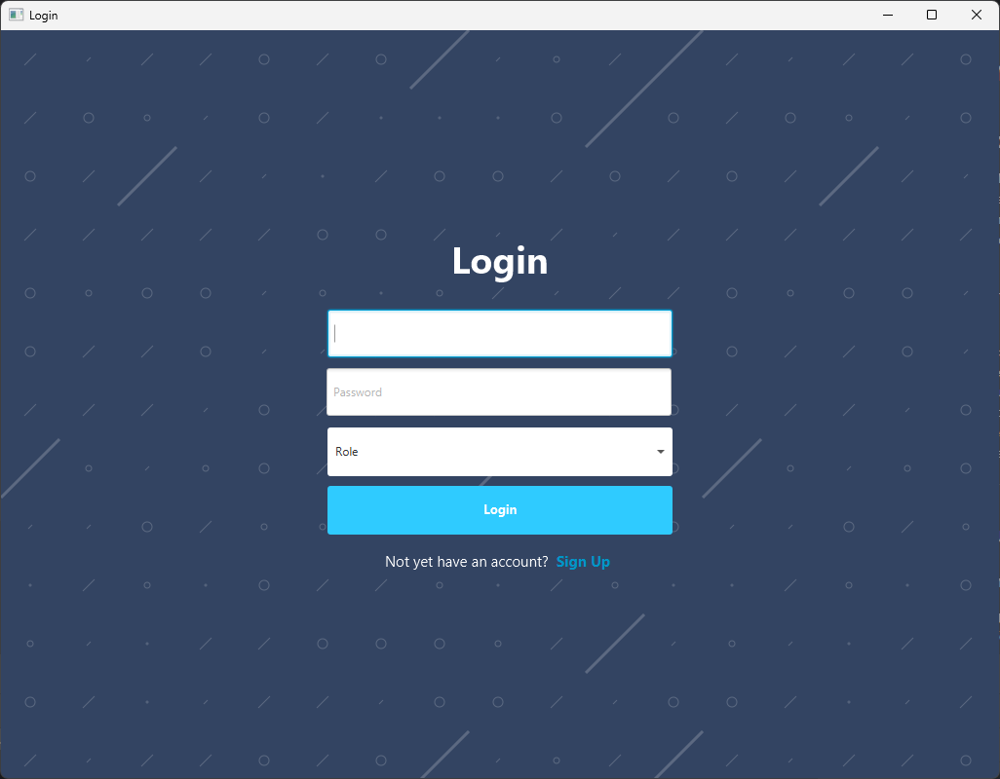
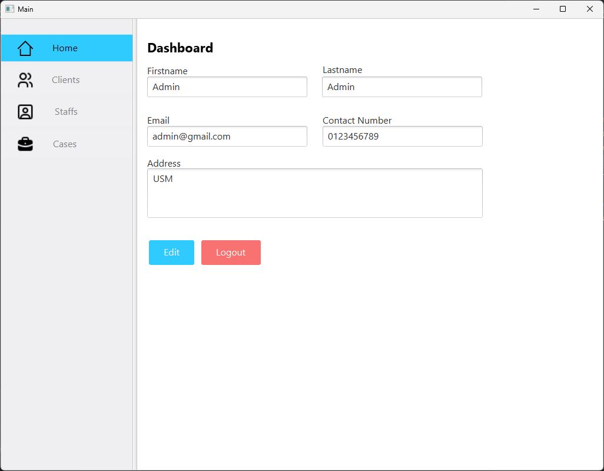

# Law Firm Management System

## 📚 Introduction
The **Law Firm Management System** is a comprehensive software solution designed to streamline administrative tasks, client management, and case organization within law firms. The system empowers administrators, staff, and paralegals with tools to efficiently manage data, reduce redundancy, and enhance overall productivity.

The system addresses three key **United Nations Sustainable Development Goals (SDGs)**:
1. **SDG 8:** Decent Work and Economic Growth – Enhancing efficiency in managing legal documentation and reducing redundancy.
2. **SDG 9:** Industry, Innovation, and Infrastructure – Transitioning from manual paper-based systems to an organized digital solution.
3. **SDG 16:** Peace, Justice, and Strong Institutions – Systematic management of legal cases, ensuring justice delivery is thorough and efficient.





---

## ⚙️ Features & Modules

### **1. User Authentication and Authorization**
- **Secure Registration Process:** Multi-step registration with validation for essential information.
- **User Login:** Authentication protocols for secure access.
- **User Roles and Permissions:** Role-based access control for staff and administrators.

### **2. User Dashboard**
- **Centralized Overview:** A dynamic dashboard displaying key metrics and recent activities.
- **Profile Information:** Update and manage personal details, including credentials and office location.

### **3. Client Management**
- **Client Information:** Centralized management of client data.
- **Add Client:** User-friendly form for adding client details.
- **Search Client:** Search interface for quick retrieval based on name, phone number, or email.

### **4. Case Management**
- **Case Operations:** Create, modify, and delete legal cases.
- **Assignment of Lawyers and Clients:** Associate staff and clients with specific cases.
- **Status Tracking:** Mechanisms to monitor case progress and updates.

### **5. Staff Management**
- **Employee Information:** Centralized staff database.
- **Add Staff:** User-friendly form for adding staff details.
- **Search Staff:** Search functionality for retrieving staff details.

---

## 🛠️ Technology Stack
- **Frontend:** JavaFX
- **Backend:** Java
- **Database:** SQLite
- **Build Tool:** Maven
- **IDE:** IntelliJ IDEA

---

## 🚀 Installation & Setup
1. Clone the repository:
   ```bash
   git clone https://github.com/danishayman/Law-Firm-Management.git
   ```
2. Navigate to the project directory:
   ```bash
   cd law-firm-management
   ```
3. Build the project using Maven:
   ```bash
   mvn clean install
   ```
4. Run the application:
   ```bash
   java --module-path /path/to/javafx-sdk/lib --add-modules javafx.controls,javafx.fxml -jar target/law-firm-management.jar
   ```

---
## 🤝 Contributing
We welcome contributions! Please follow these steps:
1. Fork the repository.
2. Create a new branch.
3. Make your changes and test thoroughly.
4. Submit a pull request.

---
